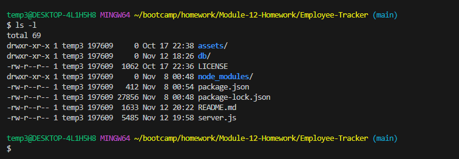

# Employee Tracker

[](https://opensource.org/licenses/MIT)
[](https://nodejs.org/en/)
[](https://www.npmjs.com/package/inquirer/v/8.2.4)

Employee Tracker is a command-line application to manage a company's employee database, using Node.js, Inquirer, and MySQL.

## Table of Contents

- [Description](#description)
- [Video Demo](#video-demo)
- [Installation](#installation)
- [Usage](#usage)
- [Features](#features)
- [References](#references)
- [Contributing](#contributing)
- [License](#license)


## Description

This application is a Content Management System (CMS) that allows users to view, add, and manage employees, roles, and departments in a company's database. It is designed for non-developers to easily interact with information stored in databases.

## Video-Demo

[]

## Installation

To install the necessary dependencies, run the following command:

```bash
npm install inquirer seed msql2
```
## Usage

To start the application, run:

    node server.js

Follow the on-screen prompts to manage the employee database.

## Features

- View all departments, roles, and employees
- Add departments, roles, and employees
- Update employee roles
- Interactive CLI
- Data persisted in MySQL database

## References




## Contributing

To contribute to Employee Tracker, please create a pull request. For major changes, please open an issue first to discuss what you would like to change.

## License

This project is licensed under the MIT license.

